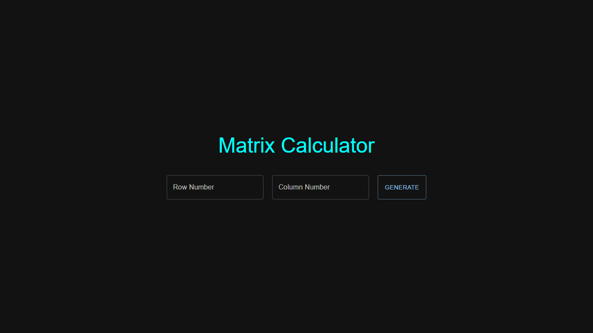

# Matrix Calculator App

- This is a Matrix calculator app where users can input the number of Rows and Columns. The Generate button will take user to the Generated Matrices page where the Summation matrix and the Multiplication matrix are shown.

- In each matrix table ->
  The cell value of the first table will be the sum of their index and
  The cell value of the second table will be multiplication of their index

- The "Add matrix" button generates a new matrix which represents the Addition of the above two matrices.

### Screenshot

## Links

- Github URL: [https://github.com/webdevsuman/matrix-calculator-webdevsuman](https://github.com/webdevsuman/matrix-calculator-webdevsuman)
- Live Site URL: [https://matrix-calculator-webdevsuman.vercel.app/](https://matrix-calculator-webdevsuman.vercel.app/)

### INSTALLATION GUIDE

- Install Node on your computer

- Install Git bash

- Open Terminal in your project folder or in VS Code terminal in the project folder

- Run these commands with Git bash:

  1. "git clone https://github.com/webdevsuman/matrix-calculator-webdevsuman.git"
  2. "npm install"
  3. "npm run dev"

- Enter the Rows and Columns number in the respected input fields.
- Click on the "Generate" button.
- Click on the "Add Matrix" button. It will generate the new Resultant matrix after addition of the sum matrix and multiplication matrix.
- Click on the "Back" button to go to the Homepage.
- Below Footer there is "Source Code" link which will take the user to the Github repository page.

## Technologies used

- React Vite
- React Hook Form
- TailwindCSS
- Material UI
- MUI Icons
